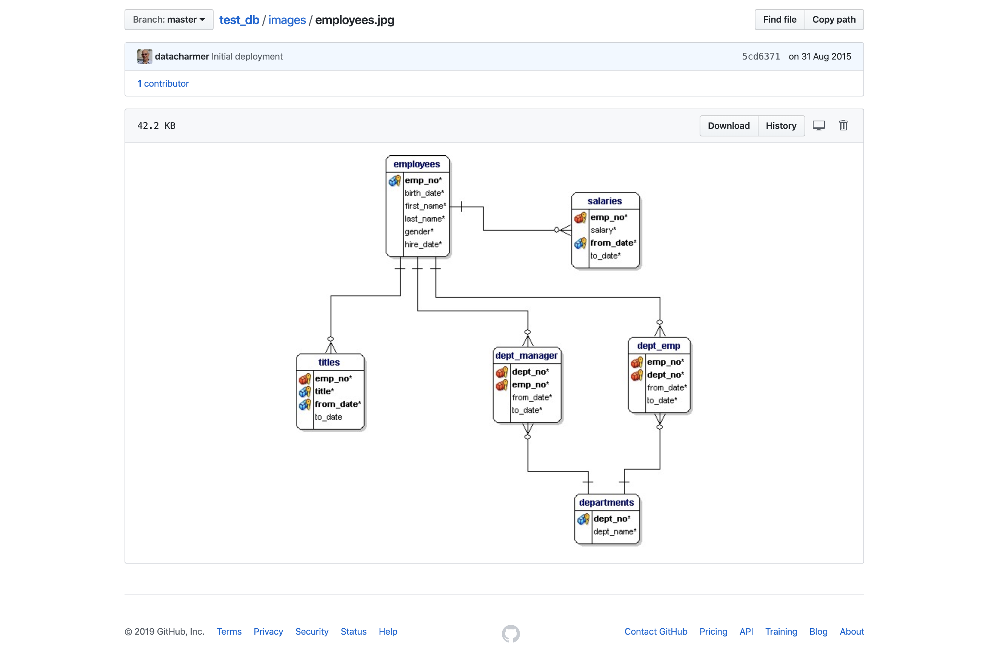
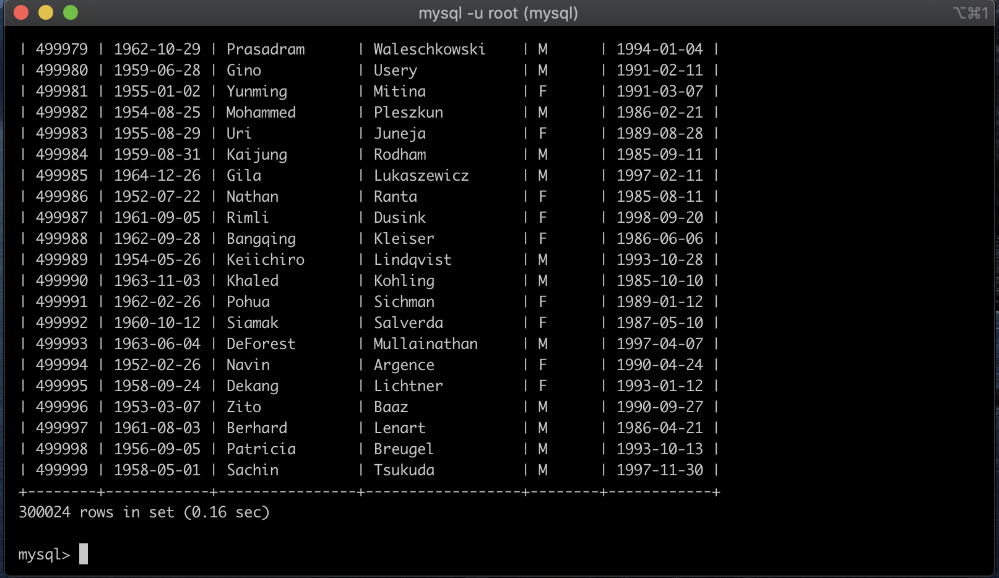
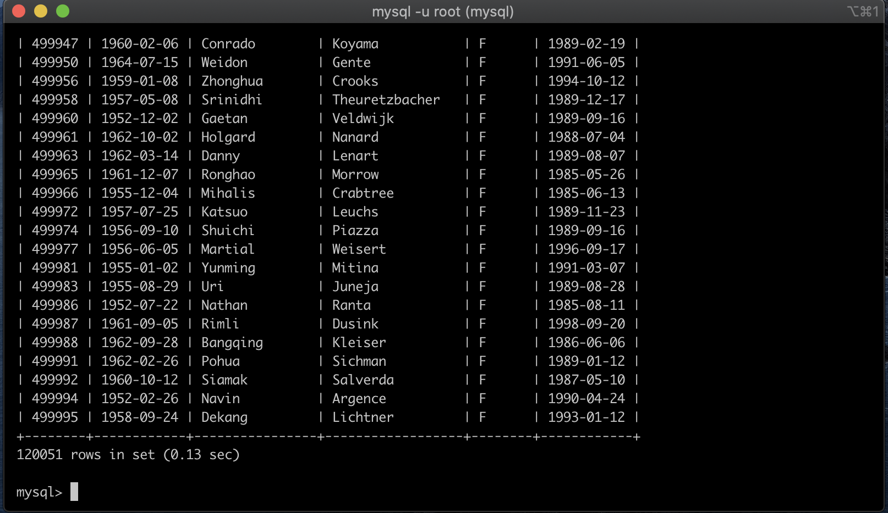
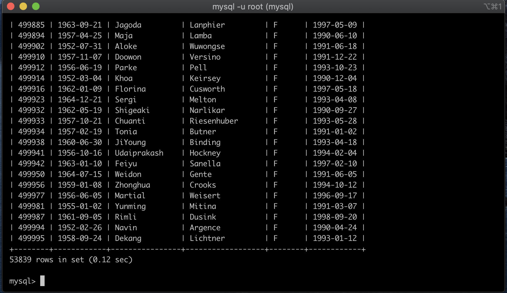
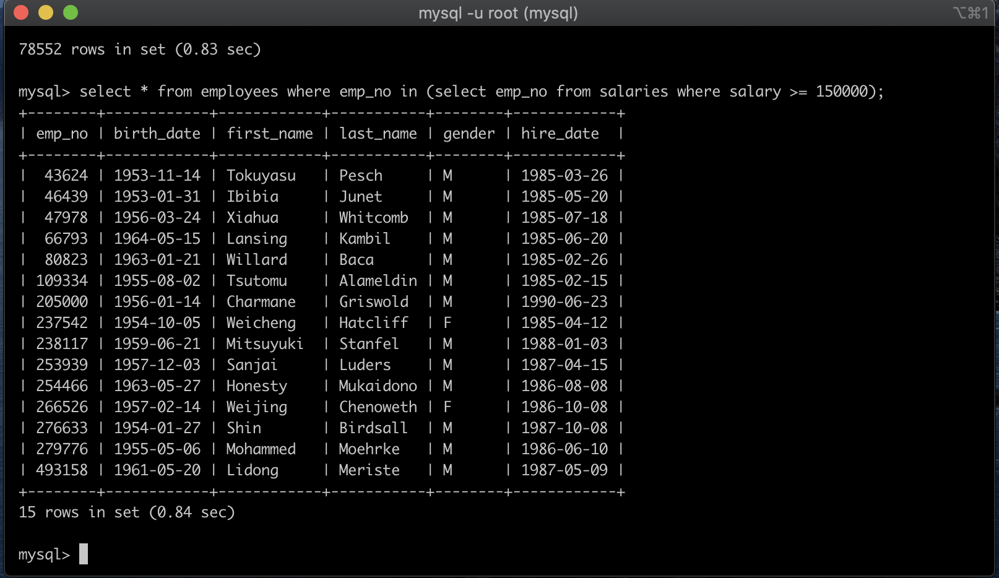
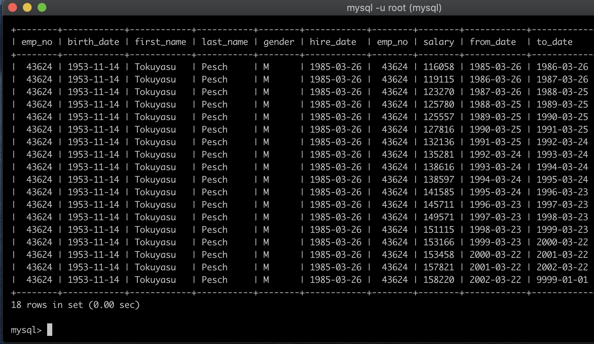
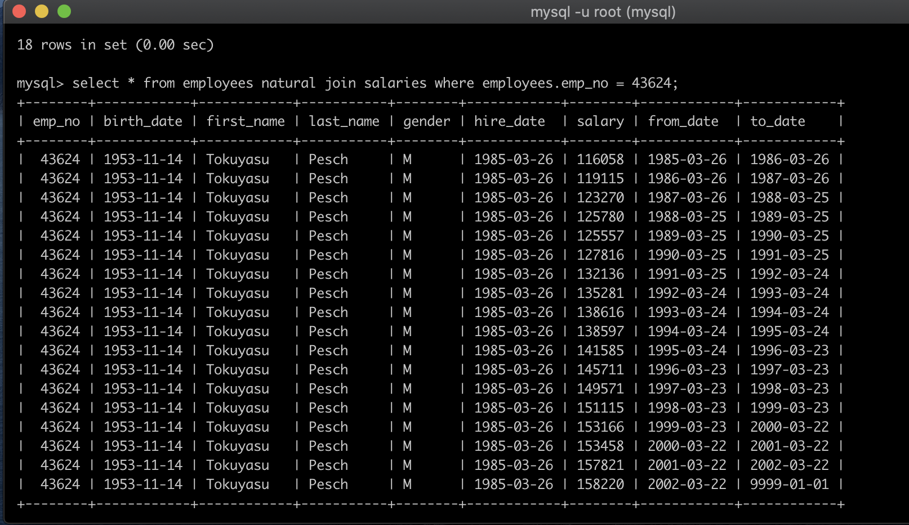

## SQL (select, 중복쿼리, 조인, 자연조인)

데이터 샘플은 https://github.com/datacharmer/test_db.git 여기서 다운받았따.

데이터베이스는 mysql를 사용하였고 employees 데이터베이스를 이용하여 연습을 진행했다.

<br/>

<br/>

employees 의 관계 구조도는 이렇게 생겼다....



<br/>

<br/>

*employees 테이블 조회*

```mysql
select * from employees;
```



약 30만개의 데이터가 있는 것을 확인할 수 있다.

<br/>

<br/>

*where 절을 이용한 employees 테이블 조회*

```mysql
select * from employees where gender = 'F';
```



여성만 뽑아봤더니 절반 이상이 줄었다.

<br/><br/>

hire_date 가 고용 시작일? 인 것 같다. 1990년부터 고용된 사람들 중 여성인 사람을 뽑아봤다.

```mysql
select * from employees where hire_date >= '1990-01-01' and gender = 'F';
```



또 절반 가량 줄었다.

<br/>

<br/>


*중복 쿼리를 이용하여 salary가 50000 이상인 사람 조회*

```mysql
select * from employees where emp_no in (select emp_no from salaries where salary >= 150000);
```



<br/>

<br/>


*조인을 이용하여 위의 사람중 한명의 salary 표를 조회*

```mysql
select * from employees, salaries where employees.emp_no = salaries.emp_no and employees.emp_no = 43624;
```



emp_no 가 43624인 사람의 1985-03-26 ~ 2002-03-22 의 salary 표를 확인할 수 있다.

하지만 지금은 컬럼(emp_no)가 중복되므로 중복을 제거하겠다.

<br/>

<br/>


*자연 조인*

```mysql
select * from employees natural join salaries where employees.emp_no = 43624;
```



굳이 where절 에서 emp_no의 값을 동등하다 비교하지 않아도 자동으로 조인해준다.

또한 중복 컬럼(emp_no)을 제거해주었다.


- like 절
- 집계함수
- group by
- asc
- desc
- having
- distinct
- ,,?